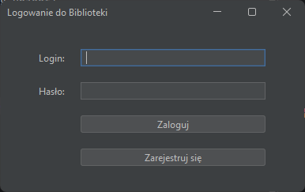
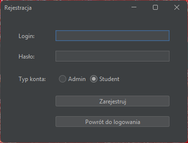
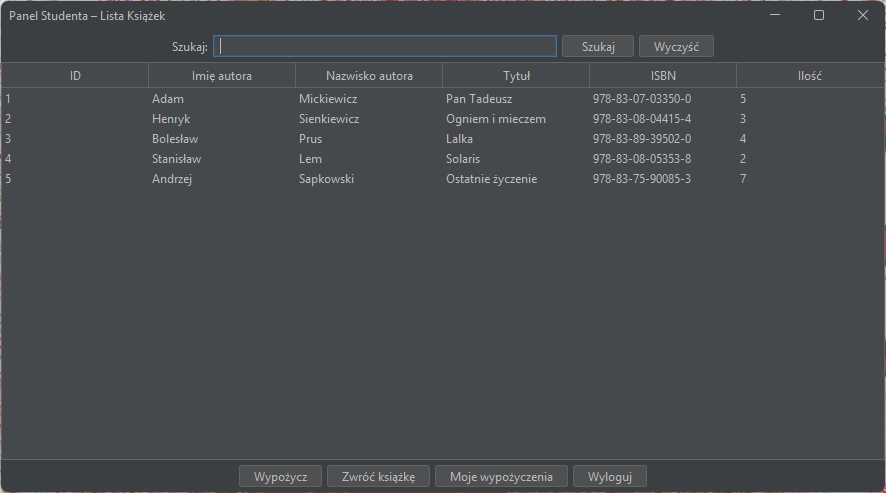
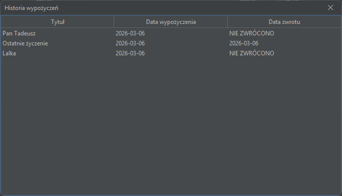
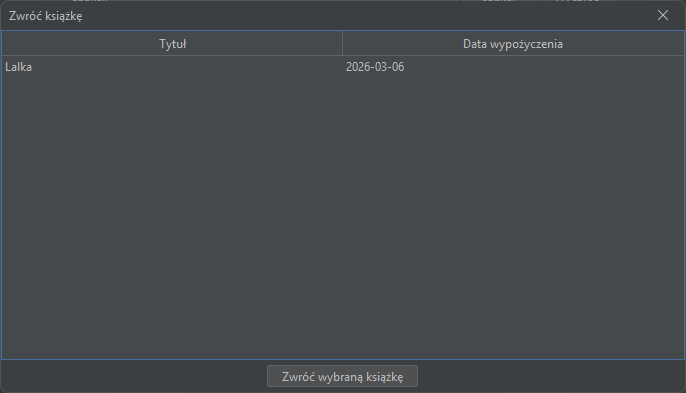
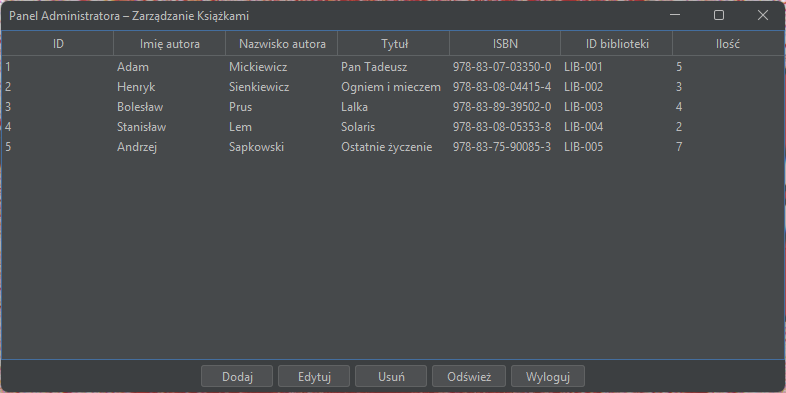
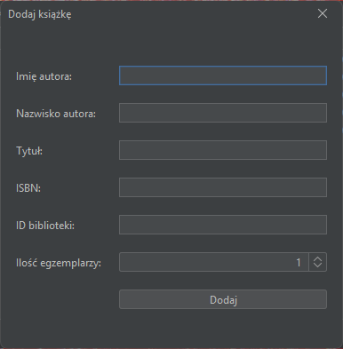
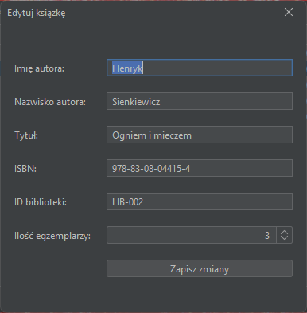

# 📚 Library Management System

Aplikacja desktopowa do zarządzania biblioteką napisana w języku Java z wykorzystaniem biblioteki Swing.
Projekt prezentuje profesjonalne podejście do architektury aplikacji (DAO),
bezpieczeństwa danych oraz nowoczesnego interfejsu użytkownika.


## ✨ Główne funkcjonalności

Projekt oferuje dwa dedykowane panele dostępu, zależne od roli zalogowanego użytkownika:

### 👨‍🎓 Panel Studenta
* **Katalog książek**: Przeglądanie pełnej listy dostępnych pozycji.
* **Wyszukiwarka**: Dynamiczne filtrowanie książek po tytule lub autorze.
* **System wypożyczeń**: Bezpieczne wypożyczanie książek z automatyczną aktualizacją stanów magazynowych.
* **Blokada duplikatów**: System uniemożliwia wypożyczenie drugiego egzemplarza tej samej książki przed zwrotem poprzedniego.
* **Historia**: Podgląd wszystkich archiwalnych i aktywnych wypożyczeń.

### 🛠️ Panel Administratora
* **Zarządzanie zasobami (CRUD)**: Pełna możliwość dodawania, edycji oraz usuwania książek z bazy danych.
* **Kontrola stanów**: Zarządzanie ilością dostępnych egzemplarzy każdej pozycji.

### 🔐 Bezpieczeństwo i Technologia
* **BCrypt**: Wszystkie hasła użytkowników są bezpiecznie haszowane przed zapisem w bazie danych.
* **Transakcje SQL**: Operacje wypożyczania i zwrotów są atomowe, co gwarantuje spójność danych.
* **Database Seeding**: Automatyczne zasilanie pustej bazy danych testowymi kontami i książkami przy pierwszym uruchomieniu.

## 🛠️ Stack Technologiczny

* **Język**: Java 21
* **GUI**: Java Swing + [FlatLaf](https://www.formdev.com/flatlaf/) (Dark Theme).
* **Baza danych**: SQLite.
* **Zarządzanie zależnościami**: Maven.
* **Architektura**: Wzorzec DAO (Data Access Object).

## 🚀 Jak uruchomić projekt?

### Opcja 1: Szybki start
Najprostszy sposób, nie wymaga konfiguracji środowiska programistycznego.
1. Pobierz gotowy plik `.jar` z sekcji **[Releases](https://github.com/ArkadiuszSzczesny/LibraryManager/releases)**.
2. Upewnij się, że masz zainstalowaną Javę (wersja 21).
3. Uruchom plik dwukrotnym kliknięciem lub komendą w terminalu:
   ```bash
   java -jar LibraryManager-1.0-SNAPSHOT.jar

### Opcja 2: Sklonuj repozytorium
```bash
   git clone https://github.com/ArkadiuszSzczesny/LibraryManager
```

2. Otwórz projekt w IntelliJ IDEA.
3. Uruchom `mvn clean install`.
4. Uruchom klasę `Main`.

## 🔑 Testowe dane logowania

Baza danych jest automatycznie zasilana przykładowymi kontami przy pierwszym uruchomieniu:

| Rola          | Login     | Hasło    |
|---------------|-----------|----------|
| Administrator | admin     | admin    |
| Student       | student   | student  |

## 📸 Prezentacja aplikacji

### System Logowania i Rejestracji




### Panel Studenta







### Panel Administracyjny




